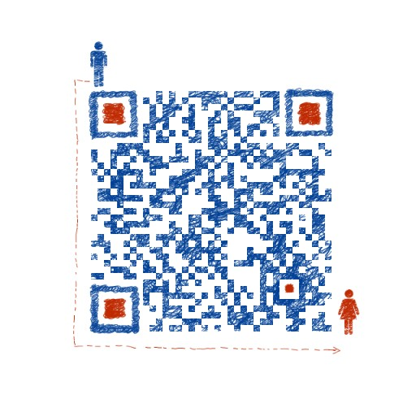

# z1_dart_gpt

这是一个用纯 Dart 编写的极小 GPT 训练与推理示例。它不依赖 PyTorch、TensorFlow、NumPy 或任何第三方机器学习库，而是从最基础的标量自动求导开始，手写一个字符级 GPT。

这个项目适合用来理解：

- 一个 GPT 模型从数据到生成文本的完整路径
- tokenizer、embedding、attention、loss、backward、optimizer 分别是什么意思
- AI 模型训练代码里每个步骤在真实人工智能开发流程中对应什么

## 文件结构

```text
.
├── bin/
│   └── z1_dart_gpt.dart
├── docs/
│   ├── beginner_playbook.md
│   └── ai_gpt_explained.md
├── input.txt
├── pubspec.yaml
└── README.md
```

主代码只有一个入口：

```bash
bin/z1_dart_gpt.dart
```

## 运行方式

默认训练 1000 步：

```bash
dart run bin/z1_dart_gpt.dart
```

如果只想快速验证代码能跑，可以减少训练步数：

```bash
Z1_DART_GPT_STEPS=10 dart run bin/z1_dart_gpt.dart
```

运行前需要在项目根目录准备本地 `input.txt`，每一行放一个训练样本，例如一个名字。程序只读取本地文件，不会联网下载数据。

如果没有 `input.txt`，可以先手动创建一个小文件试跑：

```text
王伟
李若然
张明宇
刘雨桐
陈梓涵
```

## 运行后会发生什么

程序会依次做这些事情：

1. 读取名字数据集。
2. 把字符转换成整数 token。
3. 初始化一个很小的 GPT 模型。
4. 对每个名字做“预测下一个字符”的训练。
5. 用反向传播计算梯度。
6. 用 Adam 更新参数。
7. 训练结束后，从 BOS token 开始生成新名字。

示例输出大致如下：

```text
num docs: 44928
vocab size: 328
num params: 13824
step 1000 / 1000 | loss 3.2432
--- 推理结果（生成的中文名字）---
样本  1: 韦若然
样本  2: 苏子然
...
```

因为代码里固定了随机种子：

```dart
final rng = math.Random(42);
```

所以同一份 Dart 代码每次运行的训练轨迹和生成结果通常是可复现的。

## 这段代码和真实 AI 开发的关系

这份代码是一个“缩小到显微镜下”的 AI 开发流程：

| 代码里的东西 | 等于 AI 开发中的步骤 | 意思 |
| --- | --- | --- |
| `input.txt` | 本地数据集 | 模型学习的原始样本 |
| `docs` | 样本列表 | 每一行名字就是一个训练样本 |
| `uChars` / `charToId` | tokenizer | 把文字变成模型能处理的数字 |
| `stateDict` | 模型参数 | 模型真正学习和保存知识的位置 |
| `gpt()` | 模型前向传播 | 根据已有 token 预测下一个 token |
| `softmax()` | 概率归一化 | 把 logits 变成概率分布 |
| `loss` | 训练目标 | 衡量模型预测错得有多严重 |
| `Value.backward()` | 反向传播 | 计算每个参数应该如何调整 |
| `Adam` 更新 | 优化器 | 根据梯度修改模型参数 |
| `runInference()` | 推理/生成 | 用训练后的模型生成新文本 |

更完整的逐行概念解释见：

[docs/ai_gpt_explained.md](docs/ai_gpt_explained.md)

新手从 0 开始怎么玩、怎么理解原理、怎么对应常规 AI 流程，以及后续如何演进到商业级系统，见：

[docs/beginner_playbook.md](docs/beginner_playbook.md)

## 重要说明

这个项目是教学代码，不是高性能训练框架。

它为了清楚展示 GPT 的底层机制，故意使用标量级自动求导。真实大模型训练会使用张量、GPU/TPU、批训练、并行计算、混合精度、分布式训练等工程手段。

换句话说：

- 这里的目标是“看懂 GPT 怎么工作”。
- 不是“训练一个可商用的大模型”。

## 交流 AI 技术

想交流 AI 技术，或加入 AI 交流群，可以扫码添加我的个人微信：


